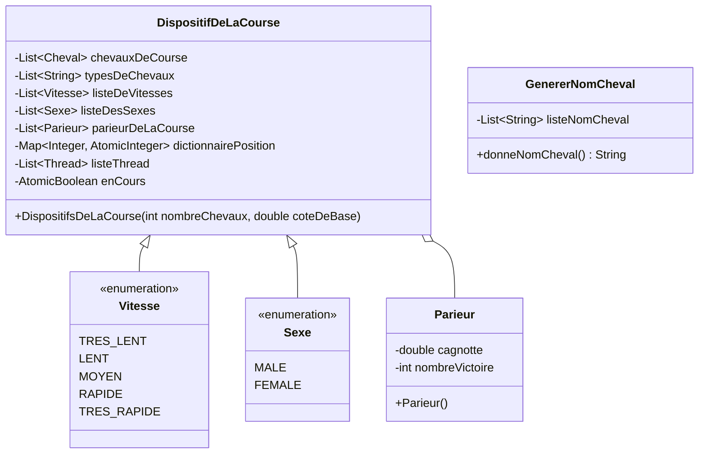

```mermaid
classDiagram
    class Cheval {
        <<abstract>>
        -String nomCheval
        -int numeroCheval
        -int nombreVictoire
        -double coteCheval
        -enum sexeCheval
        -enum vitesseCheval
        +calculNote() String
    }
    class Frisson {
        +Frisson()
        +calculNote() String
    }
   class PurSangArabe {
        +PurSangArabe()
        +calculNote() String
    }
    class Mustang {
        +Mustang()
        +calculNote() String
    }
    class PaintHorse {
        +PaintHorse()
        +calculNote() String
    }
    class QuarterHorse {
        +QuarterHorse()
        +calculNote() String
    }
    class Vitesse{
    <<enumeration>>
        TRES_LENT
        LENT
        MOYEN
        RAPIDE
        TRES_RAPIDE
        +getCoefficient() double
    }
    class Sexe{
    <<enumeration>>
        MALE
        FEMALE
    }
    
    Cheval <|-- Frisson
    Cheval <|-- PurSangArabe
    Cheval <|-- Mustang
    Cheval <|-- PaintHorse
    Cheval <|-- QuarterHorse
    Cheval <|-- Sexe
    Cheval <|-- Vitesse
    
```

```mermaid
classDiagram
     class ChevalFactory {
        <<interface>>
        +createCheval() cheval
    }
    class PaintHorseFactory {
        <<interface>>
        +createCheval() PaintHorse
    }
    class QuarterHorseFactory{
        <<interface>>
        +createCheval() QuarterHorse
    }
    class PurSangArabeFactory {
        <<interface>>
        +createCheval() PurSangArabe
    }
    class FrissonFactory {
        <<interface>>
        +createCheval() Frisson
    }
    
   class MustangFactory {
        <<interface>>
        +createCheval() Mustang
    }
    
   class Ecurie {
        +createChevalTresLent(ChevalFactory) Cheval
        +createChevalLent(ChevalFactory) Cheval
        +createChevalMoyen(ChevalFactory) Cheval
        +createChevalRapide(ChevalFactory) Cheval
        +createChevalTresRapide(ChevalFactory) Cheval
    }
    ChevalFactory <.. PaintHorseFactory
    ChevalFactory <.. QuarterHorseFactory
    ChevalFactory <.. FrissonFactory
    ChevalFactory <.. PurSangArabeFactory
    ChevalFactory <.. MustangFactory
```

```mermaid
classDiagram

    class DispositifDeLaCourse {
        -List~Cheval~ chevauxDeCourse
        -List~String~ typesDeChevaux
        -List~Vitesse~ listeDeVitesses
        -List~Sexe~ listeDesSexes
        -List~Parieur~ parieurDeLaCourse
        -Map~Integer, AtomicInteger~ dictionnairePosition
        -List~Thread~ listeThread
        -AtomicBoolean enCours
        +DispositifsDeLaCourse(int nombreChevaux, double coteDeBase)
    }
    
    class GenererNomCheval {
        -List~String~ listeNomCheval
        +donneNomCheval() String
    }
    
    class Parieur {
        -double cagnotte
        -int nombreVictoire
        +Parieur()
    }
    class Vitesse{
    <<enumeration>>
        TRES_LENT
        LENT
        MOYEN
        RAPIDE
        TRES_RAPIDE
    }
    class Sexe{
    <<enumeration>>
        MALE
        FEMALE
    }
    
    DispositifDeLaCourse <|-- Vitesse
    DispositifDeLaCourse <|-- Sexe
    DispositifDeLaCourse o-- Parieur        
```
