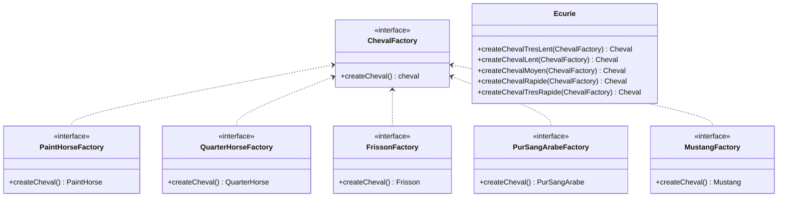
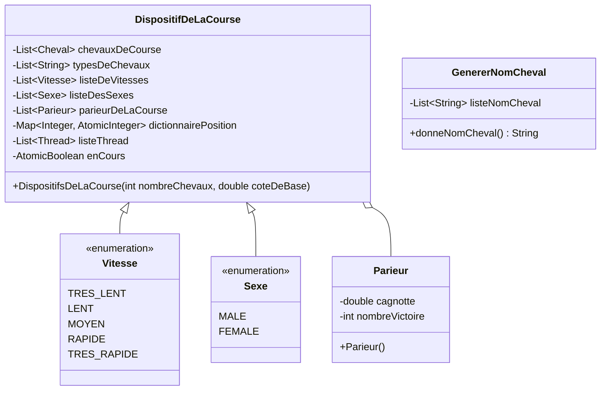

# Notice d'utilisation 🐴

Ce document à pour but d'expliquer le plus clairement possible comment utiliser notre programme.

### Étape n°1 - Choisir le nombre de chevaux

Pour ce faire, une simple entrée clavier est nécessaire. La course peut se faire entre 5 et 9 chevaux qui seront **générés aléatoirement.** 

### Étape n°2 - Choisir le nombre de parieurs

Comme le choix du nombre de chevaux, une simple entrée clavier du nombre de joueurs est requis. Le jeu peut se jouer avec entre 2 et 9 parieurs. Une saisie supplémentaire pour savoir le nom de chaque parieur est également nécessaire. Il faut aussi savoir que chaque parieur part avec une cagnotte de 50€.

### Étape n°3 - Parier sur un cheval 🐎

Une fois les noms des joueurs rentrés, les caractéristiques des différents chevaux vont s'afficher. Il faut surtout regarder la côte du cheval ainsi que son indice de vitesse *(<u>indice :</u> très lent < lent < moyennement rapide < rapide < très rapide)*. Chaque parieur va alors rentrer avec une saisie clavier le numéro du cheval sur lequel il souhaite miser **toute sa cagnotte**.

### Étape n°4 - Admirer la course

Lorsque chaque joueur a fini de parier sur son cheval, la course est définitivement lancée. L'affichage se fait de la sorte :

* On affiche en premier le numéro du cheval.
* Suivi de ça, on affiche le caractère ```-``` correspondant au chemin parcouru par le cheval.
* Ensuite, on affiche le caractère ```#``` correspondant au chemin qu'il reste à parcourir pour le cheval.
* Enfin, on affiche le caractère ```|``` correspondant à la ligne d'arrivée.

Donc, si par exemple dans une course à deux chevaux où le premier cheval a fait la moitié du parcours et le second est presque arrivée on obtient :

```
Cheval numéro 1 : -----#####|
Cheval numéro 2 : --------##|
```

### Étape n°5 - Les résultats de la course

Une fois qu'un cheval franchit la ligne d'arrivée, la course s'arrête directement, sauvegardant donc la position de chaque cheval sur le terrain.
Les résultats de la course vont alors s'afficher avec le positionnement de chaque cheval lorsque la course s'est arrêtée.

Seuls les parieurs ayant misé sur le cheval gagnant voit leur cagnotte augmenter, le reste des joueurs voient en revanche leur cagnotte baisser. Si un parieur a une cagnotte inférieure à 1€, ce dernier est alors disqualifié.

### Étape n°6 - Relancer une course ?

S'il ne reste qu'un seul parieur **ayant une cagnotte encore supérieure à 1€**, alors ce dernier est désigné vainqueur et le jeu s'arrête. Sinon, le choix est donné de relancer une course ou non. Si une course se relance, retour à l'étape n°3, sinon le jeu s'arrête et les résultats des parieurs s'affichent à l'écran.

# Diagramme de classe 





