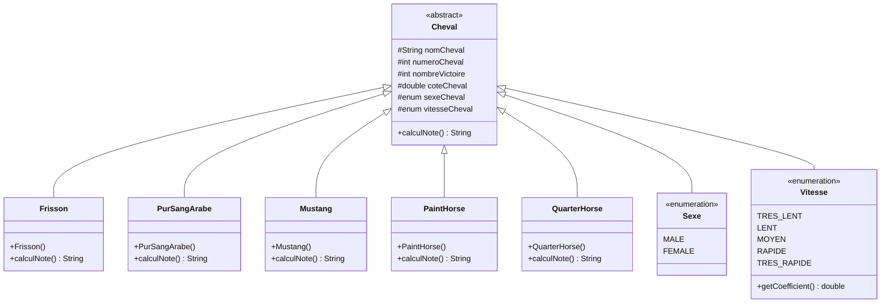
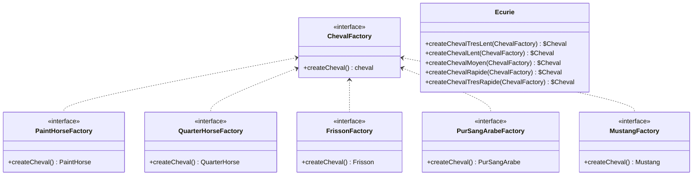
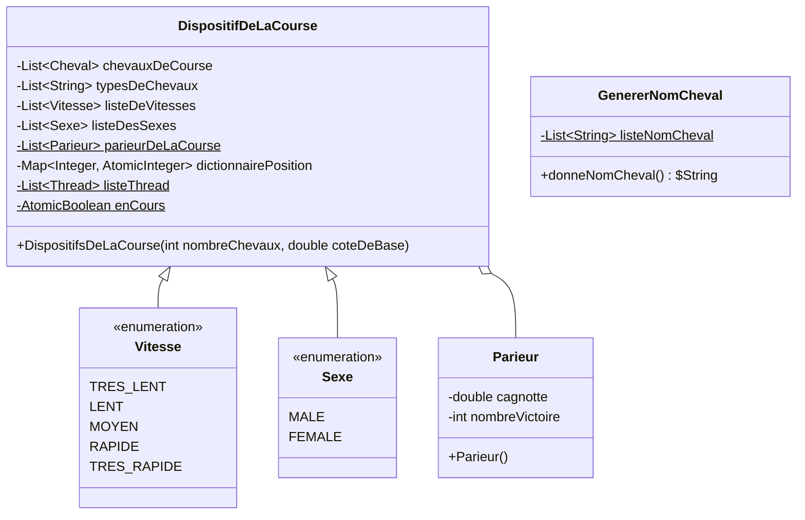

# Livrables R3.04


## <u> Présentation du projet </u>

L’objectif de ce projet était d'implémenter une application en java en utilisant un certain nombre de particularités vu en cours. Le choix du sujet était libre donc nous avons réfléchi à un sujet qui nous plaisait en imaginant comment on pourrait implémenter les particularités dans notre application.

Après une longue phase de réflexion, notre première idée concrète a été d'implémenter un combat de pokémons. La phase d’implémentation a donc commencé, mais après une bonne partie de celle-ci nous nous sommes rendu compte que nous étions bloqués par les implémentations de certaines de nos fonctionnalités que nous n'arrivons pas à implémenter en suivant notre vision de base du projet en plus d’avoir des difficultés à implémenter certaines particularités demandées. C’est pour cette raison que nous avons changé de sujet en cours de développement et nous nous sommes très rapidement orientés vers une course de chevaux (style PMU) où nous voyons plus de possibilités pour implémenter les fonctionnalités qui nous sont demandés.

Le but de ce projet est de choisir le nombre de chevaux participants à une course et ensuite de pouvoir miser sur un cheval que l’utilisateur va choisir. Tous les chevaux ont une côte plus ou moins élevée selon leur vitesse.


## <u> Synthèse </u>

Le langage utilisé pour implémenter cette application est Java. Dans cette même ressource (R3.04) nous avons dû effectuer un exposé sur les modèles de conception où notre groupe a présenté ce qu’une fabrique abstraite. C’est donc tout naturellement que nous avons choisi d’utiliser une fabrique pour notre application. Le but de notre fabrique est de nous faciliter la tâche lors de la création des différents chevaux via la création de différentes fabriques nous permettant de créer un cheval en fonction de sa vitesse.

Nous avons différentes classes pour représenter les différentes races de chevaux que nous avons implémentées dans notre application (Frisson, Mustang, Quarter Horse et Pur sang arabe). Comme dit précédemment, pour instancier ces différentes races de chevaux, nous avons créé une fabrique pour chaque race. Nous avons également crée deux enums pour pouvoir définir un sexe et une vitesse pour nos chevaux.

Il y a également une classe Parieur regroupant les différents éléments utilisés dans notre programme afin de parier sur les chevaux. Nous avons également une classe DispositifsDeLaCourse composée des différents attributs et méthodes nécessaires au bon fonctionnement de notre jeu. Enfin, nous avons une classe Cours avec la méthode static main afin de pouvoir exécuter notre programme.

Pour ce qui est de la gestion des chevaux, chaque cheval va correspondre à un thread ce qui va nous permettre d’exécuter des actions séparément pour chaque cheval participant à la course. Ainsi, chaque thread va se faire endormir pendant une durée indéterminée et variant en fonction de la vitesse du cheval avant d’incrémenter un indice correspondant à la position du cheval sur le terrain. Le premier cheval ayant atteint avec son indice la position 10 sa venir suspendre l’entièreté des threads composant les chevaux.
## <u> Problèmes rencontrés </u>

L’un des premiers problèmes que nous avons rencontré durant notre projet est évidemment la gestion du temps. En effet, notre groupe ayant changé de sujet en milieu de développement, nous n’avions sans aucun doute souffert d’un manque de temps mais nous ne pouvons que nous désigner comme responsables. Durant le développement de notre nouveau programme, nous avons rencontré un premier problème avec nos fabriques. Le problème était lié à l’héritage ou plus précisément au niveau de protection des attributs composant notre classe abstraite mère. Ensuite, nous avons rencontré un second problème lors de l’implémentation des threads dans notre programme où nous avons mis un certain temps avant de comprendre comment les suspendre et comment les faire commencer de nouveau, ce qui ne nécessite qu’au final l’appel de deux méthodes.

## <u> Ecart avec les prévisions et mesures d’amélioration </u>

Lorsque nous avons décidé de changer de sujet, nous avions pleinement conscience que nous ne devions pas voir les choses en grand si nous voulions à tout prix rendre un programme fonctionnel. De ce fait, nous n’avons pas un grand écart avec nos prévisions même si finalement, notre groupe a pu discerner plusieurs pistes d’améliorations :

* Faire en sorte qu’un parieur puisse miser la somme qu’il souhaite miser et non pas l’entièreté de sa cagnotte.
* Régler les potentiels problèmes d’affichage de la course lorsque cette dernière se relance.
* Permettre une visualisation plus claire de la course via l’utilisation de JavaFX.


# Notice d'utilisation 🐴

Ce document à pour but d'expliquer le plus clairement possible comment utiliser notre programme.

### Étape n°1 - Choisir le nombre de chevaux

Pour ce faire, une simple entrée clavier est nécessaire. La course peut se faire entre 5 et 9 chevaux qui seront **générés aléatoirement.** 

### Étape n°2 - Choisir le nombre de parieurs

Comme le choix du nombre de chevaux, une simple entrée clavier du nombre de joueurs est requis. Le jeu peut se jouer avec entre 2 et 9 parieurs. Une saisie supplémentaire pour savoir le nom de chaque parieur est également nécessaire. Il faut aussi savoir que chaque parieur part avec une cagnotte de 50€.

### Étape n°3 - Parier sur un cheval 🐎

Une fois les noms des joueurs rentrés, les caractéristiques des différents chevaux vont s'afficher. Il faut surtout regarder la côte du cheval ainsi que son indice de vitesse *(<u>indice :</u> très lent < lent < moyennement rapide < rapide < très rapide)*. Chaque parieur va alors rentrer avec une saisie clavier le numéro du cheval sur lequel il souhaite miser **toute sa cagnotte**.

### Étape n°4 - Admirer la course

Lorsque chaque joueur a fini de parier sur son cheval, la course est définitivement lancée. L'affichage se fait de la sorte :

* On affiche en premier le numéro du cheval.
* Suivi de ça, on affiche le caractère ```-``` correspondant au chemin parcouru par le cheval.
* Ensuite, on affiche le caractère ```#``` correspondant au chemin qu'il reste à parcourir pour le cheval.
* Enfin, on affiche le caractère ```|``` correspondant à la ligne d'arrivée.

Donc, si par exemple dans une course à deux chevaux où le premier cheval a fait la moitié du parcours et le second est presque arrivée on obtient :

```
Cheval numéro 1 : -----#####|
Cheval numéro 2 : --------##|
```

### Étape n°5 - Les résultats de la course

Une fois qu'un cheval franchit la ligne d'arrivée, la course s'arrête directement, sauvegardant donc la position de chaque cheval sur le terrain.
Les résultats de la course vont alors s'afficher avec le positionnement de chaque cheval lorsque la course s'est arrêtée.

Seuls les parieurs ayant misé sur le cheval gagnant voit leur cagnotte augmenter, le reste des joueurs voient en revanche leur cagnotte baisser. Si un parieur a une cagnotte inférieure à 1€, ce dernier est alors disqualifié.

### Étape n°6 - Relancer une course ?

S'il ne reste qu'un seul parieur **ayant une cagnotte encore supérieure à 1€**, alors ce dernier est désigné vainqueur et le jeu s'arrête. Sinon, le choix est donné de relancer une course ou non. Si une course se relance, retour à l'étape n°3, sinon le jeu s'arrête et les résultats des parieurs s'affichent à l'écran.


# Diagramme de classe 





